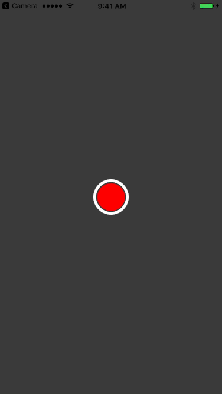

# RecordButton

iOS Button mimicking record button in Apple's VoiceRecorder app. It also displays the recording process when recording. It's great for a video recorder app with a fixed/maximum length like snapchat, vine, instragram.

It has start and stop sounds included.



## Installation

RecordButton is available through [CocoaPods](http://cocoapods.org). To install
it, simply add the following line to your Podfile:

```ruby

pod "RecordButtonSwift"

```

Add this line add the top of the file you want to use this module in `import RecordButton`

### Update progress 
*it's the easiest to just check out the example project for this.*

To update progress the RecordButton must be an instance of the class. You should also add a `progressTimer` and a `progress` variable, like this: 

```swift 

class ViewController: UIViewController {

	var recordButton : RecordButton!
	var progressTimer : NSTimer!
	var progress : CGFloat! = 0
	
	// rest of viewController 
	
```

The `recordButton` needs a target for start and stopping the progress timer. Add this code after initialization of the `recordButton` (usualy in `viewDidLoad()`)

```swift

recordButton.addTarget(self, action: "record", forControlEvents: .TouchDown)
recordButton.addTarget(self, action: "stop", forControlEvents: UIControlEvents.TouchUpInside)

```

Finally add these functions to your ViewController 

```swift

    func record() {
        self.progressTimer = NSTimer.scheduledTimerWithTimeInterval(0.05, target: self, selector: "updateProgress", userInfo: nil, repeats: true)
    }
    
    func updateProgress() {
        
        let maxDuration = CGFloat(5) // max duration of the recordButton
        
        progress = progress + (CGFloat(0.05) / maxDuration)
        recordButton.setProgress(progress)
        
        if progress >= 1 {
            progressTimer.invalidate()
        }
        
    }
    
    func stop() {
        self.progressTimer.invalidate()
    }
    
```

## Authors
| [](http://okaris.com)   | [Omer Karisman](http://okaris.com)<br/><br/><sub>Lead UI/UX @ [MojiLaLa](http://mojilala.com)</sub><br/> [![Twitter][1.1]][1] [![Dribble][2.1]][2] [![Github][3.1]][3]| [](https://twitter.com/sahinboydas)   | [Sahin Boydas](https://twitter.com/sahinboydas)<br/><br/><sub>Co-Founder @ [MojiLaLa](http://mojilala.com)</sub><br/> [![LinkedIn][4.1]][4]|
| - | :- | - | :- |

[1.1]: http://i.imgur.com/wWzX9uB.png (twitter icon without padding)
[2.1]: http://i.imgur.com/Vvy3Kru.png (dribbble icon without padding)
[3.1]: http://i.imgur.com/9I6NRUm.png (github icon without padding)
[4.1]: https://www.kingsfund.org.uk/themes/custom/kingsfund/dist/img/svg/sprite-icon-linkedin.svg (linkedin icon)

[1]: http://www.twitter.com/okarisman
[2]: http://dribbble.com/okaris
[3]: http://www.github.com/okaris
[4]: https://www.linkedin.com/in/sahinboydas


## Inspired from
samuelbeek, http://samuelbeek.com
alldritt, http://markalldritt.com
